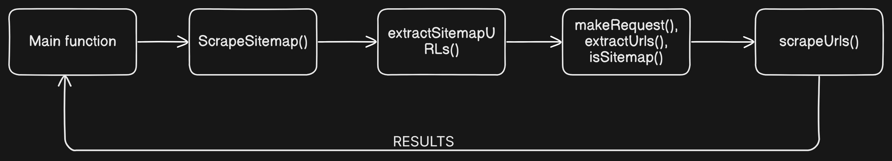

# SEO Web Scraper

## Overview
This Go program is designed to scrape SEO data (such as titles, meta descriptions, and H1 tags) from webpages. It parses a sitemap to identify URLs, then fetches and processes these pages concurrently. The program demonstrates key concepts like goroutines, concurrency, and the use of interfaces in Go.

---

## Flow Chart



---

## Table of Contents
- [How It Works](#how-it-works)
- [Main Functions](#main-functions)
  - [main](#main)
  - [ScrapeSitemap](#scrapesitemap)
  - [extractSitemapURLs](#extractsitemapurls)
  - [makeRequest](#makerequest)
  - [extractUrls](#extracturls)
  - [isSitemap](#issitemap)
  - [scrapeUrls](#scrapeurls)
  - [scrapePage](#scrapepage)
  - [randomUserAgent](#randomuseragent)
  - [GetSeoData](#getseodata)

---

## How It Works
1. The program starts by fetching the sitemap (`sitemap.xml`) from the given URL.
2. It parses the sitemap to extract URLs and identifies whether they are regular pages or nested sitemap files.
3. Using goroutines, it scrapes the identified pages concurrently while respecting a concurrency limit.
4. For each page, it extracts SEO-related data like:
   - Title
   - Meta description
   - First `<h1>` tag
   - HTTP status code
5. The extracted data is displayed in the console.

---

## Main Functions

### `main`
- **Purpose**: Entry point of the application.
- **What It Does**:
  - Creates an instance of `DefaultParser`.
  - Calls `ScrapeSitemap` with the sitemap URL and parser instance.
  - Prints the SEO data collected from the pages.

---

### `ScrapeSitemap`
- **Purpose**: Combines URL extraction and scraping logic.
- **What It Does**:
  1. Extracts URLs from the given sitemap using `extractSitemapURLs`.
  2. Crawls and scrapes the extracted URLs using `scrapeUrls`.
  3. Returns the collected SEO data.

---

### `extractSitemapURLs`
- **Purpose**: Extracts all URLs from a given sitemap.
- **What It Does**:
  - Starts with the initial sitemap URL.
  - Fetches the sitemap and identifies URLs for:
    - Nested sitemaps (`.xml` files).
    - Web pages.
  - Crawls nested sitemaps recursively.
- **Returns**: A list of all webpage URLs to scrape.

---

### `makeRequest`
- **Purpose**: Makes an HTTP GET request to a given URL.
- **What It Does**:
  - Sets a random `User-Agent` header for the request.
  - Sends the request using a timeout-enabled HTTP client.
  - Returns the HTTP response or an error.

---

### `extractUrls`
- **Purpose**: Extracts `<loc>` tags from an XML response.
- **What It Does**:
  - Parses the response body using `goquery`.
  - Finds all `<loc>` tags in the XML.
  - Extracts and returns the URLs.

---

### `isSitemap`
- **Purpose**: Separates sitemap files from regular page URLs.
- **What It Does**:
  - Checks each URL for the presence of "xml" to determine if it's a sitemap.
  - Returns two lists:
    1. Sitemap URLs
    2. Regular webpage URLs

---

### `scrapeUrls`
- **Purpose**: Scrapes SEO data from a list of URLs concurrently.
- **What It Does**:
  - Uses a channel (`tokens`) to limit the number of concurrent requests.
  - Scrapes each URL using `scrapePage`.
  - Collects and returns the SEO data.

---

### `scrapePage`
- **Purpose**: Scrapes SEO data for a single webpage.
- **What It Does**:
  1. Makes an HTTP request using `makeRequest`.
  2. Uses the provided parser (`DefaultParser`) to extract SEO data.
  3. Returns the scraped data or an error.

---

### `randomUserAgent`
- **Purpose**: Selects a random `User-Agent` string for HTTP requests.
- **What It Does**:
  - Picks a random string from a predefined list of user agents.
  - Returns the selected string.

---

### `GetSeoData`
- **Purpose**: Extracts SEO data from an HTTP response.
- **What It Does**:
  - Parses the response body using `goquery`.
  - Extracts:
    - URL
    - Title
    - First `<h1>` tag
    - Meta description (`<meta name="description">`)
    - HTTP status code
  - Returns the extracted data.

---

## Dependencies
- **[goquery](https://github.com/PuerkitoBio/goquery)**: A library for HTML document manipulation and data extraction.
- **Standard Library**:
  - `net/http`: For making HTTP requests.
  - `math/rand`: For generating random user agents.
  - `log`: For logging errors and status.

---

## Running the Program
1. Ensure you have Go installed on your machine.
2. Clone this repository and navigate to the project directory.
3. Run the program:
   ```bash
   go run main.go
